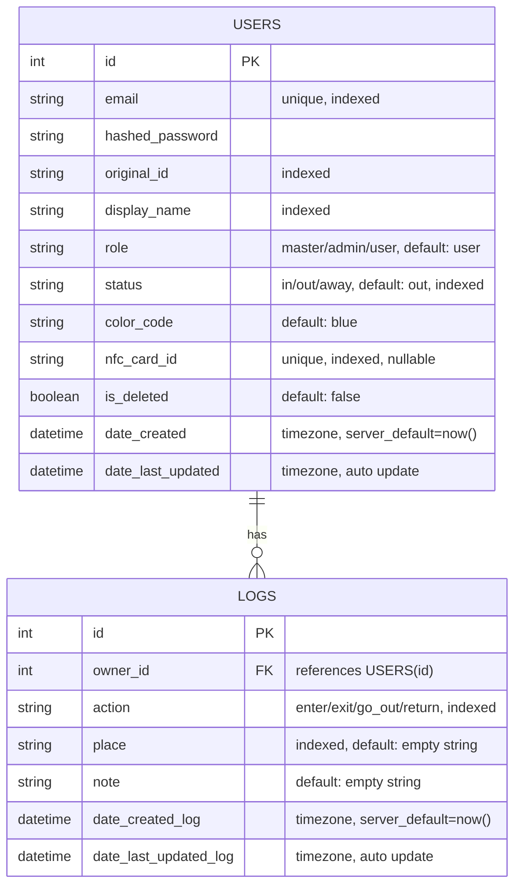

# Imasu - サークル向け入退室管理アプリ

<p align="center">
  <strong>「今、誰が部室にいるかわからない」を解決する</strong>
</p>

---

## プロジェクト概要

本プロジェクトは、所属サークルにおける実際の組織運営上の課題を解決するために開発したWebアプリケーションです。

- FastAPIチュートリアルで学んだ基礎をベースに開発
- 要件定義・DB設計・API設計をすべてゼロから実施
- 実際のサークル運営を想定した実用的なユースケース

現在は **MVP（Minimum Viable Product）** として、以下にフォーカスしています：

- 入退室記録の管理
- 在室状況のリアルタイム可視化

---

## 主要機能

| 機能 | 説明 |
|------|------|
| **ユーザー認証** | JWTによるステートレス認証、ロール管理（master/admin/user） |
| **入退室ログ** | `enter` / `exit` / `go_out` / `return` のアクション記録 |
| **ステータス連動** | ログ作成と同時にユーザー状態（`in`/`out`/`away`）を自動更新 |
| **ユーザー検索** | クエリパラメータで柔軟にフィルタリング（例: `GET /api/users?status=in`） |

---

## Tech Stack

### Backend

| カテゴリ | 技術 |
|----------|------|
| Language | Python 3.12 |
| Framework | FastAPI |
| Database | SQLite |
| ORM | SQLAlchemy |
| Migration | Alembic |
| Validation | Pydantic V2 |
| Auth | JWT (PyJWT) / bcrypt (passlib) |

### Frontend

| カテゴリ | 技術 |
|----------|------|
| Framework | React 19 |
| Build Tool | Vite |
| Styling | Tailwind CSS v4 |
| Routing | React Router DOM v7 |
| HTTP Client | Axios |

### Development

| 環境 | ツール |
|------|------|
| OS | Windows 11 / WSL2 |

---

## データベース設計（ER図）

**設計方針:** USERS と LOGS は 1対多のリレーション



---

## 技術的工夫・トラブルシューティング

### Backend

<details>
<summary><strong>1. トランザクション設計によるデータ整合性の確保</strong></summary>

入退室ロジックにおいて、「ログの記録」と「ユーザー状態（in/out等）の更新」に不整合が生じるのを防ぐための設計を行いました。

- **トランザクション単位での確定:** 「ログ追加」と「ステータス更新」の2つのDB操作を準備し、最後に1回の `db.commit()` で同時に確定
- **辞書マッピングの活用:** `action` → `status` の変換に `status_map` を使用し、冗長な `if-elif` を排除

</details>

<details>
<summary><strong>2. RESTful原則に基づいたAPI設計へのリファクタリング</strong></summary>

初期段階では機能ごとにエンドポイントを作成していましたが、APIの拡張性と可読性を高めるためリソース指向へリファクタリングを行いました。

| Before | After |
|--------|-------|
| `GET /api/get_in_users` | `GET /api/users?status=in` |

**改善ポイント:** 動詞を排除し、リソース指向のURL設計を採用。クエリパラメータにより1つのエンドポイントで柔軟な絞り込みに対応。

</details>

<details>
<summary><strong>3. セキュリティと権限を考慮したエンドポイントの分離</strong></summary>

ユーザー情報の更新機能において、「誰が・どのデータを変更して良いか」という権限の境界線を明確にしました。

- **関心の分離:** プロフィール情報（表示名、テーマカラー）とシステム情報（学籍番号、NFC ID）の更新エンドポイントを分離
- **セキュリティ向上:** ユーザーが重要なシステムデータを上書きする脆弱性を防止

</details>

<details>
<summary><strong>4. Pydantic V2を活用したセキュアで柔軟なデータハンドリング</strong></summary>

フレームワークの機能を最大限に活用し、セキュアかつフロントエンドに優しいAPIを構築しました。

- **機密情報の自動除外:** `response_model` 指定により、パスワードハッシュ等をレスポンスから自動除外
- **Partial Update:** `str | None = None` で部分更新を実現、未送信項目は更新しない

</details>

<details>
<summary><strong>5. 依存ライブラリのバージョン競合解決</strong></summary>

- **発生問題:** `passlib` と `bcrypt` (v4.0+) の非互換性により `AttributeError` が発生
- **解決策:** `bcrypt==3.2.0` にバージョン固定して安定稼働を実現

</details>

### Frontend

<details>
<summary><strong>6. 新規登録と同時に自動ログインするUX設計</strong></summary>

バックエンドの新規登録APIが直接JWTトークンを返す仕様を活かし、「アカウント登録と同時に自動ログインし、シームレスにホーム画面へ遷移する」フローを実装。ユーザーが登録後に再度ログインする手間を排除しました。

</details>

<details>
<summary><strong>7. Tailwind CSSの動的クラス名制約の回避</strong></summary>

Tailwind CSSはビルド時に静的解析を行うため、`bg-${color}` のような動的クラス名生成は機能しません。ユーザーが自由に選択したテーマカラー（HEXコード）をUIに反映するため、インラインスタイル（`style={{}}`）を併用するアプローチを採用しました。

```jsx
// × 動作しない例
className={`bg-[${user.color_code}]`}

// ○ インラインスタイルで解決
style={{ backgroundColor: user.color_code }}
```

</details>

<details>
<summary><strong>8. AxiosインターセプターによるJWT自動付与</strong></summary>

全てのAPIリクエストに対して認証トークンを手動で付与するのは煩雑かつバグの原因となります。Axiosのリクエストインターセプターを設定し、`localStorage`から取得したトークンを`Authorization`ヘッダーに自動付与する共通処理を実装しました。

</details>

---

## ディレクトリ構成

```bash
Imasu/
├── backend/
│   ├── main.py          # APIエンドポイント定義
│   ├── database.py      # DB接続設定
│   ├── models.py        # SQLAlchemyモデル
│   ├── services.py      # ビジネスロジック
│   ├── schemas.py       # Pydanticスキーマ
│   ├── .env.example     # 環境変数サンプル
│   └── requirements.txt
└── frontend/
    ├── src/
    │   ├── api.js       # Axiosインスタンス設定
    │   ├── App.jsx      # ルーティング定義
    │   ├── main.jsx     # エントリーポイント
    │   ├── index.css    # グローバルスタイル
    │   ├── Home.jsx     # ホーム画面（在室状況一覧）
    │   ├── Login.jsx    # ログイン画面
    │   ├── Register.jsx # 新規登録画面
    │   ├── Profile.jsx  # プロフィール画面
    │   └── Logs.jsx     # 入退室ログ履歴画面
    ├── package.json
    └── vite.config.js
```

---

## セットアップ方法

### Backend

```bash
# 1. 移動
cd backend

# 2. 仮想環境
python3 -m venv venv
source venv/bin/activate  # Windows: venv\Scripts\activate

# 3. 依存インストール
pip install -r requirements.txt

# 4. 環境変数設定
cp .env.example .env

# 5. マイグレーション
alembic upgrade head

# 6. サーバー起動
fastapi dev main.py
```

👉 Swagger UI: http://localhost:8000/docs

### Frontend

```bash
# 1. 移動
cd frontend

# 2. 依存インストール
npm install

# 3. 開発サーバー起動
npm run dev
```

👉 Frontend: http://localhost:5173

> ⚠️ バックエンドAPI（`http://localhost:8000`）が起動している必要があります

---

## Live Demo

| サービス | URL |
|----------|-----|
| Backend API | （デプロイ後に記載予定） |
| Frontend | （デプロイ後に記載予定） |

---

## Roadmap

### 短期目標

| 機能 | 説明 |
|------|------|
| Discord Webhook | 入退室ログ作成時に自動通知 |
| RBAC | admin専用管理画面、打刻修正機能 |

### 中長期目標

| 機能 | 説明 |
|------|------|
| マルチテナント化 | 複数団体対応（サークル/ゼミ/研究室） |
| ダッシュボード | 個人活動時間の可視化、混雑分析 |
| IoT連携 | Raspberry Pi + NFCでICカード打刻 |
| ネットワーク制限 | 部室Wi-Fi経由のみ受付（エア入室防止） |

---

## Author

**Kota-James** - [GitHub](https://github.com/Kota-James)
