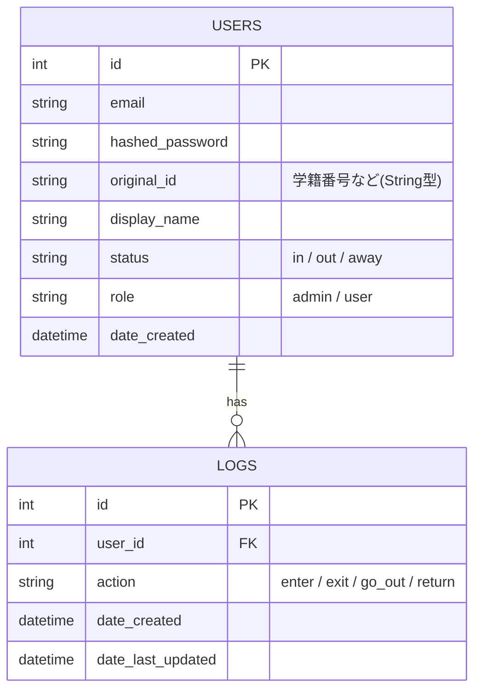

# Imasu - サークル向け入退室管理アプリ (Backend)

## 1. プロジェクト概要

> 「今、誰が部室にいるかわからない」

本プロジェクトは、所属サークルにおける実際の組織運営上の課題を解決するために開発したWebアプリケーションのバックエンドAPIです。  
以前、チュートリアル（見込み顧客管理アプリ）で学んだFastAPIの基礎知識をベースにしつつ、今回は要件定義・データベース設計・API設計の全てをゼロから自身のユースケースに合わせて構築しました。

現在はMVP（Minimum Viable Product）として、入退室記録と在室状況の可視化に焦点を絞って実装しています。

---

## 2. 実装した機能と技術スタック

### 主要機能

#### ユーザー認証・管理
- JWT (JSON Web Token) を用いたステートレス認証
- ユーザープロフィールの登録・更新

#### 入退室ログ管理 (CRUD)
- ユーザーの入退室アクション（Enter, Exit, Go Out, Return）の記録
- 自身のログ履歴の取得

#### ステータス自動連動
- 打刻ログの作成と同時に、ユーザーの現在ステータス（in / out / away）を自動更新するビジネスロジックの実装

#### 柔軟なユーザー検索
- クエリパラメータを用いた在室者（status=in）のフィルタリング取得

---

### 技術スタック

- **Language:** Python 3.12  
- **Framework:** FastAPI  
- **Database:** SQLite (Dev), SQLAlchemy (ORM), Alembic (Migration)  
- **Validation:** Pydantic V2  
- **Authentication:** PyJWT, passlib[bcrypt]  
- **Frontend:** React (MVP構成)  
- **Dev Environment:** Windows 11 + WSL2 (Ubuntu 24.04)

---

## 3. データベース設計 (ER図)

ユーザー (users) が複数のログ (logs) を持つ **1対多** の関係で設計しています。



---

## 4. 技術的な工夫・トラブルシューティング

単に動くものを作るだけでなく、保守性や拡張性、安全性を考慮して以下の設計・対応を行いました。

### API設計のリファクタリング（RESTfulの徹底）

開発当初は `GET /api/get_in_users` という動詞を含んだエンドポイントを作成していましたが、リソース指向の設計原則に基づきリファクタリングを行いました。  

現在は  

`GET /api/users?status=in`  

という形で、一つのエンドポイントで「全ユーザー取得」と「フィルタリング取得」を柔軟に行える設計に変更しています。

---

### トランザクションによるデータの整合性確保

「ログの新規追加」と「ユーザー情報のステータス更新」という2つのDB書き込み操作が発生する際、途中でエラーが起きた場合のデータ不整合を防ぐため、処理の最後に1回の `db.commit()` で同時に確定するトランザクション設計を採用しました。

---

### Pydantic V2によるレスポンスの安全性向上

APIのレスポンス時にパスワード等の機密情報が漏洩しないよう、エンドポイントのデコレータに `response_model` を明示的に指定。  

DBモデル（SQLAlchemy）からPydanticスキーマへ変換する際、自動的に機密情報を除外する安全な構成を徹底しました。

---

### 依存ライブラリのバージョン競合の解決

開発中、`passlib` と最新の `bcrypt (v4.0+)` の間で `AttributeError` が発生する相性問題に直面しました。  

エラーログから原因を特定し、`bcrypt` のバージョンを `3.2.0` に固定することで解決しました。

---

## 5. ディレクトリ構成

```bash
web-app/
├── backend/                # FastAPI / SQLAlchemy
│   ├── main.py             # アプリケーションエントリポイント / ルーティング
│   ├── database.py         # DB接続設定・セッション管理
│   ├── models.py           # DBテーブル定義 (SQLAlchemy Models)
│   ├── services.py         # ビジネスロジック・認証処理・CRUD操作
│   ├── schemas.py          # データバリデーション・シリアライズ (Pydantic)
│   ├── .env.example        # 環境変数テンプレート
│   └── requirements.txt    # 依存ライブラリ一覧
└── frontend/               # React / Node.js
    ├── src/
    │   ├── components/     # UIコンポーネント
    │   └── App.js          # メインロジック
    └── package.json
```

---

## 6. セットアップと実行方法

### バックエンド (Local)

```bash
# 1. ディレクトリ移動
cd backend

# 2. 仮想環境の作成とアクティベート
python3 -m venv venv
source venv/bin/activate  # Windows: venv\Scripts\activate

# 3. 依存関係のインストール
pip install -r requirements.txt

# 4. 環境変数の設定
# .env.example をコピーして .env を作成し、SECRET_KEY等を設定してください

# 5. データベースのマイグレーション
alembic upgrade head

# 6. サーバー起動
fastapi dev main.py
```

APIドキュメント (Swagger UI):  
http://localhost:8000/docs

---

## 7. 今後の展望 (Roadmap)

本番運用に向けて、ユーザビリティと管理機能を強化する以下の機能を実装予定です。

---

### 短期的な目標（機能強化）

#### Discord Webhook連携

入退室ログが作成されたタイミングで、サークルのDiscordサーバーへリアルタイム通知を送信。  
「アプリを開かなくても誰が来たかわかる」状態を目指します。

#### Roleベースの権限管理 (RBAC)

`admin` 権限を持つユーザーのみがアクセスできる管理画面の実装。  

- 他ユーザーの打刻修正機能（打刻忘れ対応）
- ユーザーアカウントの管理機能

---

### 中長期的な目標（サービス拡大・UX向上）

#### グループ機能（マルチテナント化）

現在は単一のサークル向けですが、複数の団体（他のサークル、ゼミ、研究室など）がそれぞれ独立して利用できるグループ機能を実装予定です。

これにより、大学内の他のコミュニティにもサービスを展開し、より多くの学生の課題解決を目指すプラットフォームへと拡張させます。

---

#### ダッシュボード・統計機能

個人の活動時間や、部室の混雑時間帯をグラフ化し、活動状況を可視化することで部員のモチベーション向上に繋げます。

---

#### IoT・ハードウェア連携 (Raspberry Pi + NFC)

学生証（ICカード）をタッチするだけで入退室打刻が完了する物理デバイスの開発。

スマホを取り出してログインする手間を省略し、よりシームレスな利用体験を提供します。

---

#### ネットワーク制限による不正打刻防止

部室のWi-Fi経由のリクエストのみを受け付ける（IPアドレス制限等）ことで、部室外からの不正な「エア入室」を防止する仕組みを検討中です。

---

## 8. プロジェクト情報

- **Author:** Kota-James  
- **GitHub:** https://github.com/Kota-James
