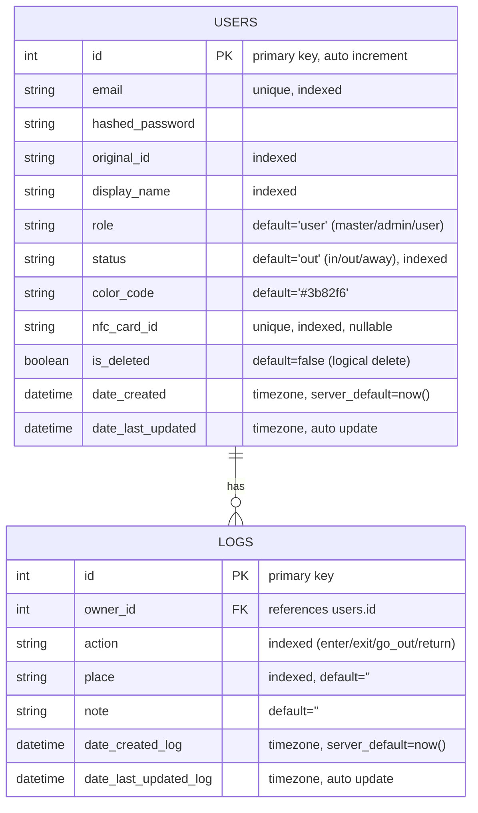

# Imasu - サークル向け入退室管理アプリ (Backend)

---

## 1. プロジェクト概要

> **「今、誰が部室にいるかわからない」**

本プロジェクトは、所属サークルにおける実際の組織運営上の課題を解決するために開発した  
**WebアプリケーションのバックエンドAPI**です。

- FastAPIチュートリアルで学んだ基礎をベースに開発
- 要件定義・DB設計・API設計をすべてゼロから実施
- 実際のサークル運営を想定した実用的なユースケース

現在は **MVP（Minimum Viable Product）** として、以下にフォーカスしています。

- 入退室記録の管理
- 在室状況のリアルタイム可視化

---

## 2. 実装機能と技術スタック

### ■ 主要機能

### 1. ユーザー認証・管理

- JWT（JSON Web Token）によるステートレス認証
- ユーザー登録・プロフィール更新
- ロール管理（admin / user）

---

### 2. 入退室ログ管理（CRUD）

- アクション記録  
  - `enter`
  - `exit`
  - `go_out`
  - `return`
- 自身のログ履歴取得

---

### 3. ステータス自動連動

- ログ作成と同時にユーザーステータスを更新
  - `in`
  - `out`
  - `away`
- ビジネスロジック層で一元管理

---

### 4. 柔軟なユーザー検索

- クエリパラメータによるフィルタリング取得
  - 例：`GET /api/users?status=in`

---

## 技術スタック

- **Language**
  - Python 3.12

- **Framework**
  - FastAPI

- **Database**
  - SQLite（開発環境）
  - SQLAlchemy（ORM）
  - Alembic（Migration）

- **Validation**
  - Pydantic V2

- **Authentication**
  - PyJWT
  - passlib[bcrypt]

- **Frontend**
  - React（MVP構成）

- **開発環境**
  - Windows 11
  - WSL2（Ubuntu 24.04）

---

## 3. データベース設計（ER図）

### ■ 設計方針

- USERS と LOGS は **1対多**
- ユーザーは複数のログを保持




---

## 4. 技術的工夫・トラブルシューティング

### 1. RESTful設計へのリファクタリング

初期設計：
```
GET /api/get_in_users
```

改善後：
```
GET /api/users?status=in
```

改善ポイント：

- 動詞を排除しリソース指向へ変更
- 単一エンドポイントで汎用的な取得を実現
- 拡張性の向上

---

### 2. トランザクション設計による整合性確保

課題：

- ログ追加
- ユーザーステータス更新

2つのDB操作が存在。

対策：

- 最後に1回の `db.commit()` を実行
- トランザクション単位で確定
- データ不整合を防止

---

### 3. Pydantic V2によるレスポンス安全化

- `response_model` を明示指定
- パスワード等の機密情報を自動除外
- ORM → Schema 変換時に安全性担保

---

### 4. bcrypt バージョン競合問題

発生問題：

- `passlib` と `bcrypt v4.0+` の互換性問題
- `AttributeError` 発生

解決策：

- `bcrypt==3.2.0` に固定
- 依存バージョンを明示管理

---

## 5. ディレクトリ構成

```bash
web-app/
├── backend/
│   ├── main.py
│   ├── database.py
│   ├── models.py
│   ├── services.py
│   ├── schemas.py
│   ├── .env.example
│   └── requirements.txt
└── frontend/
    ├── src/
    │   ├── components/
    │   └── App.js
    └── package.json
```

---

## 6. セットアップ方法

### バックエンド（ローカル環境）

```bash
# 1. 移動
cd backend

# 2. 仮想環境
python3 -m venv venv
source venv/bin/activate  # Windows: venv\Scripts\activate

# 3. 依存インストール
pip install -r requirements.txt

# 4. 環境変数設定
# .env.example をコピーして .env を作成

# 5. マイグレーション
alembic upgrade head

# 6. サーバー起動
fastapi dev main.py
```

Swagger UI:
```
http://localhost:8000/docs
```

---

## 7. Roadmap（今後の展望）

---

### ■ 短期目標

#### 1. Discord Webhook連携

- 入退室ログ作成時に自動通知
- アプリを開かなくても在室状況確認可能

---

#### 2. RBAC（Role Based Access Control）

- admin専用管理画面
- 打刻修正機能
- ユーザー管理機能

---

### ■ 中長期目標

#### 1. マルチテナント化（グループ機能）

- 複数団体対応
- サークル / ゼミ / 研究室対応
- プラットフォーム化

---

#### 2. ダッシュボード・統計機能

- 個人活動時間の可視化
- 混雑時間帯の分析
- モチベーション向上

---

#### 3. IoT連携（Raspberry Pi + NFC）

- ICカードタッチで打刻
- ログイン不要
- UX向上

---

#### 4. 不正打刻防止（ネットワーク制限）

- 部室Wi-Fi経由のみ受付
- IP制限導入
- エア入室防止

---

## 8. プロジェクト情報

- **Author**
  - Kota-James

- **GitHub**
  - https://github.com/Kota-James
