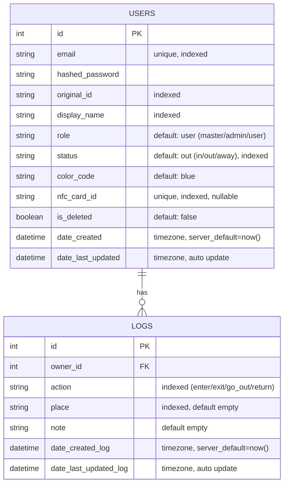

# Imasu - サークル向け入退室管理アプリ (Backend)

## 1. プロジェクト概要

> **「今、誰が部室にいるかわからない」**

本プロジェクトは、所属サークルにおける実際の組織運営上の課題を解決するために開発した  
**WebアプリケーションのバックエンドAPI**です。

- FastAPIチュートリアルで学んだ基礎をベースに開発
- 要件定義・DB設計・API設計をすべてゼロから実施
- 実際のサークル運営を想定した実用的なユースケース

現在は **MVP（Minimum Viable Product）** として、以下にフォーカスしています。

- 入退室記録の管理
- 在室状況のリアルタイム可視化

---

## 2. 実装機能と技術スタック

### ■ 主要機能

### 1. ユーザー認証・管理
- JWT（JSON Web Token）によるステートレス認証
- ユーザー登録・プロフィール更新
- ロール管理（master / admin / user）

### 2. 入退室ログ管理（CRUD）
- アクション記録  
  - `enter`
  - `exit`
  - `go_out`
  - `return`
- 自身のログ履歴取得

### 3. ステータス自動連動
- ログ作成と同時にユーザーステータスを更新
  - `in`
  - `out`
  - `away`
- ビジネスロジック層で一元管理

### 4. 柔軟なユーザー検索
- クエリパラメータによるフィルタリング取得  
  - 例：`GET /api/users?status=in`

## ■ Tech Stack

- language: Python 3.12
- framework: FastAPI
- database: SQLite
- orm: SQLAlchemy
- migration: Alembic
- schema validation: Pydantic V2
- authentication: JWT (PyJWT) / bcrypt (passlib)
- frontend: React
- dev environment: Windows 11 / WSL2

---

## 3. データベース設計（ER図）

### ■ 設計方針
- USERS と LOGS は 1対多
- ユーザーは複数のログを保持




---

## 4. 技術的工夫・トラブルシューティング

### 1. トランザクション設計によるデータ整合性の確保とロジック最適化
入退室ロジックにおいて、「ログの記録」と「ユーザー状態（in/out等）の更新」に不整合が生じるのを防ぐための設計を行いました。
- **トランザクション単位での確定:** 「ログ追加」と「ステータス更新」という2つのDB操作を準備したのち、最後に1回の `db.commit()` で同時に確定（セーブ）する設計を採用。途中でエラーが起きた際のデータ不整合を物理的に防止しています。
- **辞書（マッピング）を活用した保守性の向上:** ログの `action` からユーザーの `status` を決定する際、冗長な `if-elif` 文の羅列を避け、辞書（`status_map`）を用いたマッピングを採用。将来的なステータス追加時も、辞書に1行追加するだけで対応可能な保守性の高いコードを実現しました。

### 2. RESTful原則に基づいたAPI設計へのリファクタリング
初期段階では機能ごとにエンドポイントを作成していましたが、APIの拡張性と可読性を高めるためリソース指向へリファクタリングを行いました。
- **改善前（動詞ベース）:** `GET /api/get_in_users`
- **改善後（名詞＋クエリパラメータ）:** `GET /api/users?status=in`
- **改善ポイント:** 動詞を排除し、「誰の」「どのリソースか」が直感的にわかるURL設計（例: `GET /api/users/me/logs` と `POST /api/users/me/logs` の統一）を採用。また、クエリパラメータを導入したことで、1つのエンドポイントで「全件取得」から「条件絞り込み」まで汎用的に対応可能にしました。

### 3. セキュリティと権限を考慮したエンドポイントの分離
ユーザー情報の更新機能において、「誰が・どのデータを変更して良いか」という権限の境界線を明確にしました。
- **関心の分離:** ユーザーが自由に変更できる「プロフィール情報（表示名、テーマカラー等）」と、システムや管理者が扱うべき「システム情報（学籍番号、NFC ID等）」の更新エンドポイントとPydanticスキーマを明確に分離。
- **セキュリティ向上:** これにより、ユーザーがプロフィール更新APIを叩いた際に、誤って（あるいは意図的に）重要なシステムデータを上書きしてしまう脆弱性を防いでいます。

### 4. Pydantic V2を活用したセキュアで柔軟なデータハンドリング
フレームワークの機能を最大限に活用し、セキュアかつフロントエンドに優しいAPIを構築しました。
- **機密情報の自動除外 (レスポンスの安全化):** APIのデコレータに `response_model` を明示指定。DBモデルにパスワードハッシュが含まれていても、JSON変換時に自動的に除外される仕組みを確立し、情報漏洩を防止しています。
- **Partial Update (部分更新) の実現:** 更新用スキーマにおいて各フィールドを `str | None = None` で定義し、送信されなかった項目は更新しない（無視する）設計を採用。フロントエンド側の通信量と実装コストを削減しました。

### 5. 依存ライブラリのバージョン競合解決 (トラブルシューティング)
- **発生問題:** 認証機能の実装中、`passlib` と最新の `bcrypt` (v4.0+) 間の非互換性により `AttributeError` が発生し、サーバーがクラッシュする問題に直面。
- **解決策:** エラーログから原因がライブラリ間の仕様変更にあると特定し、環境構築時に `bcrypt==3.2.0` とバージョンを明示的に固定することで解決。要件を満たしつつ安定稼働する環境を構築しました。

## 5. ディレクトリ構成

```bash
Imasu/
├── backend/
│   ├── main.py
│   ├── database.py
│   ├── models.py
│   ├── services.py
│   ├── schemas.py
│   ├── .env.example
│   └── requirements.txt
└── frontend/
    ├── src/
    │   ├── components/
    │   └── App.js
    └── package.json
```

---

## 6. セットアップ方法

### バックエンド（ローカル環境）

```bash
# 1. 移動
cd backend

# 2. 仮想環境
python3 -m venv venv
source venv/bin/activate  # Windows: venv\Scripts\activate

# 3. 依存インストール
pip install -r requirements.txt

# 4. 環境変数設定
# .env.example をコピーして .env を作成

# 5. マイグレーション
alembic upgrade head

# 6. サーバー起動
fastapi dev main.py
```

Swagger UI:
```
http://localhost:8000/docs
```

---

## 7. Live Demo

- **Backend API:** （デプロイ後に記載予定）
- **Frontend:** （デプロイ後に記載予定）

---

## 8. Roadmap（今後の展望）

### ■ 短期目標

#### 1. Discord Webhook連携
- 入退室ログ作成時に自動通知
- アプリを開かなくても在室状況確認可能

#### 2. RBAC（Role Based Access Control）
- admin専用管理画面
- 打刻修正機能
- ユーザー管理機能

### ■ 中長期目標

#### 1. マルチテナント化（グループ機能）
- 複数団体対応
- サークル / ゼミ / 研究室対応
- プラットフォーム化

#### 2. ダッシュボード・統計機能
- 個人活動時間の可視化
- 混雑時間帯の分析
- モチベーション向上

#### 3. IoT連携（Raspberry Pi + NFC）
- ICカードタッチで打刻
- ログイン不要
- UX向上

#### 4. 不正打刻防止（ネットワーク制限）
- 部室Wi-Fi経由のみ受付
- IP制限導入
- エア入室防止

---

## 9. プロジェクト情報

- **Author**
  - Kota-James

- **GitHub**
  - https://github.com/Kota-James
